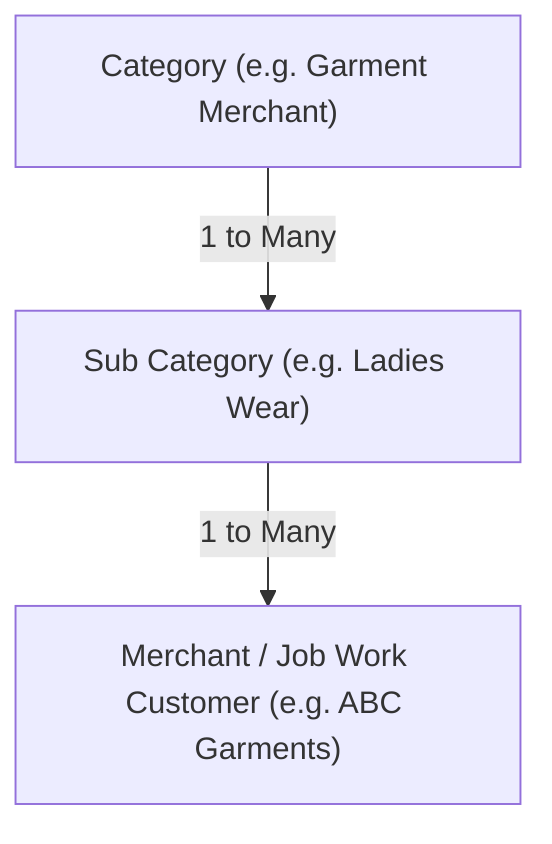

# Embroidery ERP - Backend API

Production-ready Backend API microservice architecture for Embroidery ERP Software. Built with Node.js, Express.js, MongoDB, Mongoose, JWT, Cloudinary, and bcrypt.

---

## 📋 Implemented Modules

1. **Authentication API**: User registration with numeric auto-incrementing IDs, login, profile retrieval by ID, JWT authorization, protected logout, role-based access control (`admin`, `manager`, `staff`).
2. **Category Master Module**: Full CRUD for product categories with numeric auto-increment ID, unique constraint and deletion protection.
3. **Sub Category Master Module**: Full CRUD for sub-categories with numeric auto-increment ID, referenced to Categories with compound uniqueness (`categoryId` + `name`) and deletion protection.
4. **Merchant / Job Work Customer Module**: Master data module for job work customers with GST & PAN document references, numeric auto-increment ID, category-subcategory relationship validation, search & filtering.
5. **Standalone Upload Module**: Independent file upload service supporting single and multiple file uploads directly to Cloudinary (RAM memory storage, zero local disk storage).

---

## 📁 Project Structure

```
src/
├── config/
│   ├── db.js                    # Database connection setup
│   └── cloudinary.js            # Cloudinary configuration & buffer uploader
├── controllers/
│   ├── Auth/
│   │   └── auth.js              # Auth controller handlers
│   ├── Category/
│   │   └── category.js          # Category controller handlers
│   ├── SubCategory/
│   │   └── subCategory.js       # SubCategory controller handlers
│   ├── Merchant/
│   │   └── merchant.js          # Merchant controller handlers
│   └── Upload/
│       └── upload.js            # Standalone Upload controller (single & multiple)
├── middleware/
│   ├── Auth/
│   │   └── auth.js              # Auth & Role middleware guards
│   └── Common/
│       ├── error.js             # 404 & Centralized error handler
│       ├── upload.js            # Multer RAM memory storage middleware
│       └── validate.js          # Request validation error handler
├── models/
│   ├── Auth/
│   │   └── auth.js              # User Mongoose model
│   ├── Category/
│   │   └── category.js          # Category Mongoose model (Numeric custom ID)
│   ├── SubCategory/
│   │   └── subCategory.js       # SubCategory Mongoose model (Numeric custom ID)
│   ├── Merchant/
│   │   └── merchant.js          # Merchant Mongoose model (Numeric custom ID)
│   └── Common/
│       └── counter.js           # Shared numeric sequence Counter model
├── routes/
│   ├── Auth/
│   │   └── auth.js              # Auth routes (/api/auth)
│   ├── Category/
│   │   └── category.js          # Category routes (/api/categories)
│   ├── SubCategory/
│   │   └── subCategory.js       # SubCategory routes (/api/subcategories)
│   ├── Merchant/
│   │   └── merchant.js          # Merchant routes (/api/merchants)
│   └── Upload/
│       └── upload.js            # Upload routes (/api/upload/single, /api/upload/multiple)
├── services/
│   ├── Auth/
│   │   └── auth.js              # Auth business logic service
│   ├── Category/
│   │   └── category.js          # Category business logic service
│   ├── SubCategory/
│   │   └── subCategory.js       # SubCategory business logic service
│   ├── Merchant/
│   │   └── merchant.js          # Merchant business logic service
│   └── Upload/
│       └── upload.js            # Upload business logic service
├── utils/
│   ├── Auth/
│   │   ├── generateToken.js     # JWT token generator
│   │   └── validators.js        # Auth validators
│   ├── Category/
│   │   └── validators.js        # Category validators
│   ├── SubCategory/
│   │   └── validators.js        # SubCategory validators
│   ├── Merchant/
│   │   └── validators.js        # Merchant validators
│   └── Common/
│       ├── apiResponse.js       # Success response helper
│       └── customError.js       # Custom operational error class
├── app.js                       # Express app configuration
└── server.js                    # Server startup script
tests/
├── auth.test.js                 # Auth integration tests (13 tests)
├── category.test.js             # Category integration tests (6 tests)
├── subCategory.test.js          # SubCategory integration tests (6 tests)
├── merchant.test.js             # Merchant integration tests (7 tests)
└── upload.test.js               # Upload integration tests (3 tests)
```

---

## 🔌 API Endpoints Summary

### Authentication APIs (`/api/auth`)
| Method | Endpoint             | Access    | Description                                      |
| :----- | :------------------- | :-------- | :----------------------------------------------- |
| `POST` | `/api/auth/register` | Public    | Register user with numeric ID & JWT token        |
| `POST` | `/api/auth/login`    | Public    | Login user & return JWT token                    |
| `GET`  | `/api/auth/profile`  | Protected | Retrieve logged-in user profile                  |
| `GET`  | `/api/auth/profile/:id`| Protected| Retrieve user profile by numeric ID              |
| `POST` | `/api/auth/logout`   | Protected | Invalidate/logout active token session           |

### Category APIs (`/api/categories`)
| Method   | Endpoint               | Access                   | Description                                     |
| :------- | :--------------------- | :----------------------- | :---------------------------------------------- |
| `POST`   | `/api/categories`      | Admin, Manager           | Create a new category                           |
| `GET`    | `/api/categories`      | Admin, Manager, Staff    | Get all categories                              |
| `GET`    | `/api/categories/:id`  | Admin, Manager, Staff    | Get single category by numeric ID               |
| `PUT`    | `/api/categories/:id`  | Admin, Manager           | Update category by numeric ID                   |
| `DELETE` | `/api/categories/:id`  | Admin, Manager           | Delete category (protected against in-use items)|

### Sub Category APIs (`/api/subcategories`)
| Method   | Endpoint                             | Access                | Description                                        |
| :------- | :----------------------------------- | :-------------------- | :------------------------------------------------- |
| `POST`   | `/api/subcategories`                 | Admin, Manager        | Create a new sub-category                          |
| `GET`    | `/api/subcategories`                 | Admin, Manager, Staff | Get all sub-categories                             |
| `GET`    | `/api/subcategories/:id`             | Admin, Manager, Staff | Get single sub-category by numeric ID              |
| `GET`    | `/api/subcategories/category/:catId` | Admin, Manager, Staff | Get all sub-categories for a specific category ID  |
| `PUT`    | `/api/subcategories/:id`             | Admin, Manager        | Update sub-category by numeric ID                  |
| `DELETE` | `/api/subcategories/:id`             | Admin, Manager        | Delete sub-category (protected against in-use items)|

### Merchant / Job Work Customer APIs (`/api/merchants`)
| Method   | Endpoint              | Access                | Description                                          |
| :------- | :-------------------- | :-------------------- | :--------------------------------------------------- |
| `POST`   | `/api/merchants`      | Admin, Manager        | Create a new merchant/customer                       |
| `GET`    | `/api/merchants`      | Admin, Manager, Staff | Get all merchants (support search, categoryId filter)|
| `GET`    | `/api/merchants/:id`  | Admin, Manager, Staff | Get single merchant by numeric ID                    |
| `PUT`    | `/api/merchants/:id`  | Admin, Manager        | Update merchant by numeric ID                        |
| `DELETE` | `/api/merchants/:id`  | Admin, Manager        | Delete merchant by numeric ID                        |

### Standalone Upload APIs (`/api/upload`)
| Method | Endpoint                | Access                | Description                                                          |
| :----- | :---------------------- | :-------------------- | :------------------------------------------------------------------- |
| `POST` | `/api/upload/single`   | Admin, Manager, Staff | Upload single file, returns `{ path, fullUrl }`                      |
| `POST` | `/api/upload/multiple` | Admin, Manager, Staff | Upload multiple files (max 10), returns array `[{ path, fullUrl }]` |

---

## 🔗 Category → Sub Category → Merchant Relationship Model



1. **Category**: High-level business classification (e.g., *Garment Merchant*, *Saree Manufacturer*).
2. **Sub Category**: Belongs to 1 specific Category (e.g., *Ladies Wear*, *Kids Wear*).
3. **Merchant (Job Work Customer)**: Must reference both a **Category** and a **Sub Category**.
   - **Enforced Business Rule**: The selected `subCategoryId` MUST belong to the selected `categoryId`. If mismatched, the request is rejected with `400 Bad Request`.
